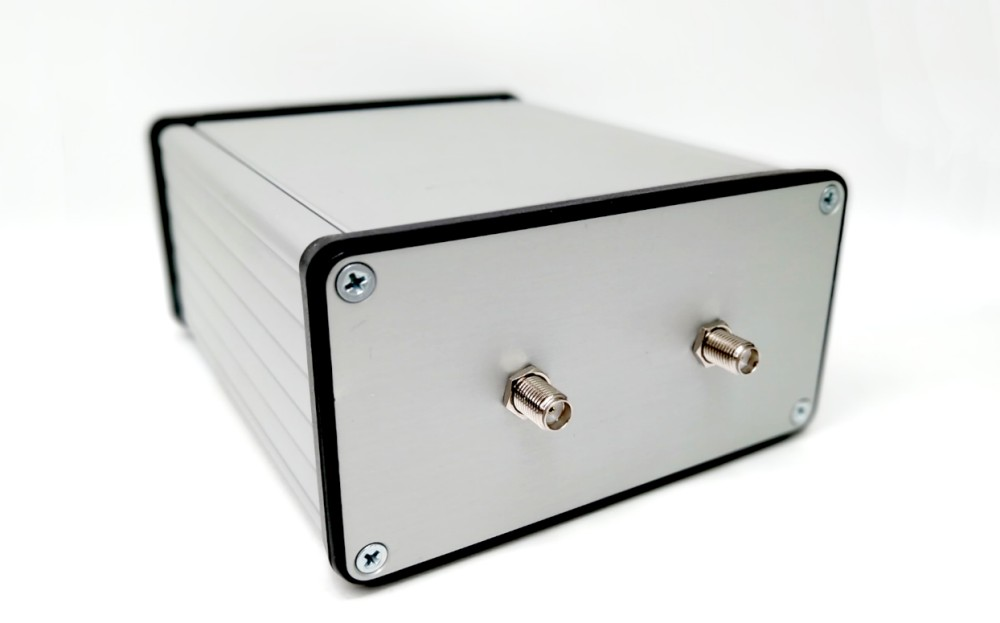
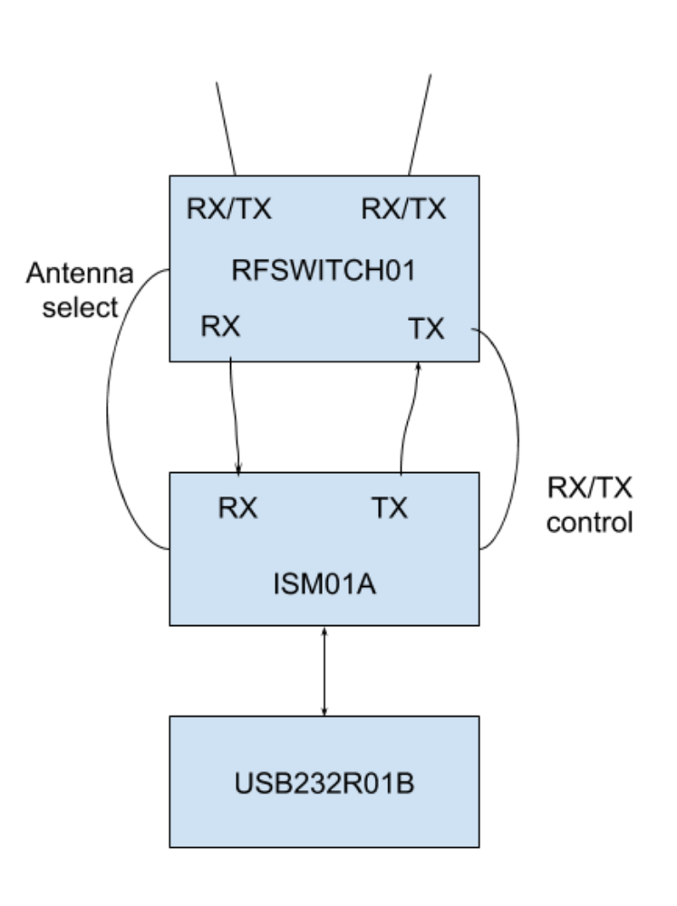

# TFMODEM01A -  ThunderFly ground SiK radio telemetry system

The modem is part of the ThunderFly ground control station. It is based on our port of widely-used [SiK firmware](https://github.com/ThunderFly-aerospace/SiK), which is ported to upgraded Si1060 SiliconLabs chip. Although this new chip supports new features, the TFMODEM is backward compatible with older SiK devices.

The modem could be extended up to four antenna MIMO configuration by adding the external RF switch network (optional extension device).

## Parameters

  * Supported protocol: MAVLink 2
  * Supported bands: 433MHz, 868 MHz.
  * Modem chip: Si4463
    * User selectable output power up to +20 dBm
    * RX Sensitivity -124 dBm @ 1000 bps FSK
  * MIMO RX/TX: 2 Antenna
  * Automatic antenna switching
  * Interface: full-speed USB 2.0 USB-B
  * RF switch: SPDT High Power UltraCMOS 10 MHz - 3 GHz
  * RF input amplifier
    * 50MHz to 4000MHz, GaAs pHEMT SPF5189
    * Noise Figure 0.60dB
    * High noise imunity OIP3 39.5dBm
    * Gain 18.7dB
  * Filter: SAW AFS selected for specific ISM band
  * Power: USB +5V 500 mA.

## Where to get it?

ThunderFly ground control station telemetry modem is commercially available from [ThunderFly s.r.o.](https://www.thunderfly.cz/), write an email to info@thunderfly.cz or shop at [Tindie store](https://www.tindie.com/products/thunderfly/tfmodem01-sik-telemetry-ground-station-unit/).

